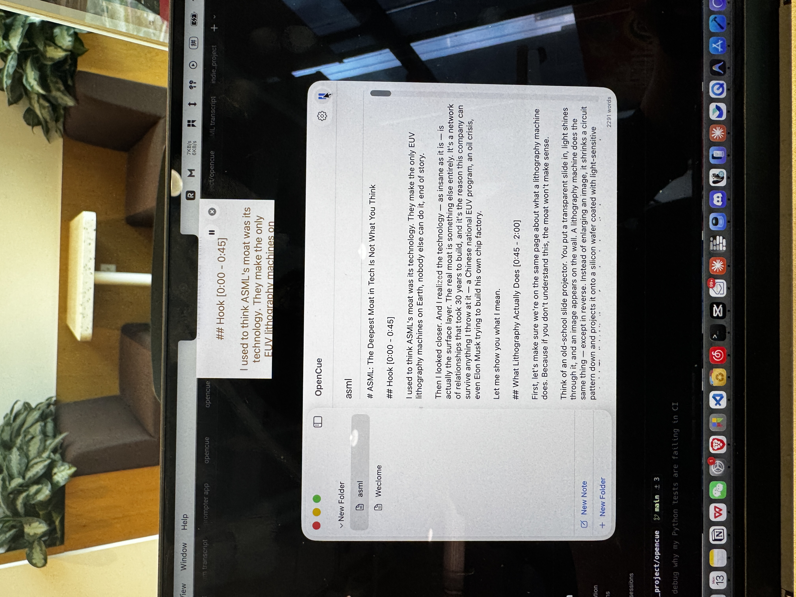
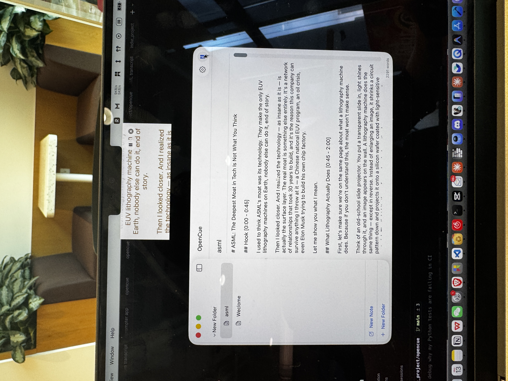
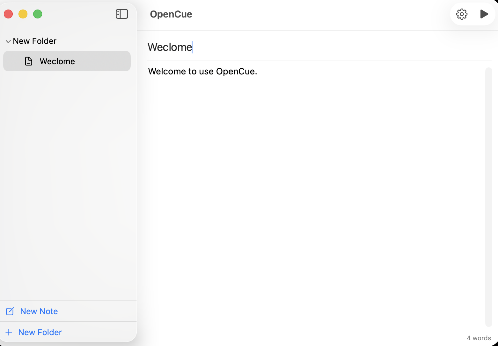
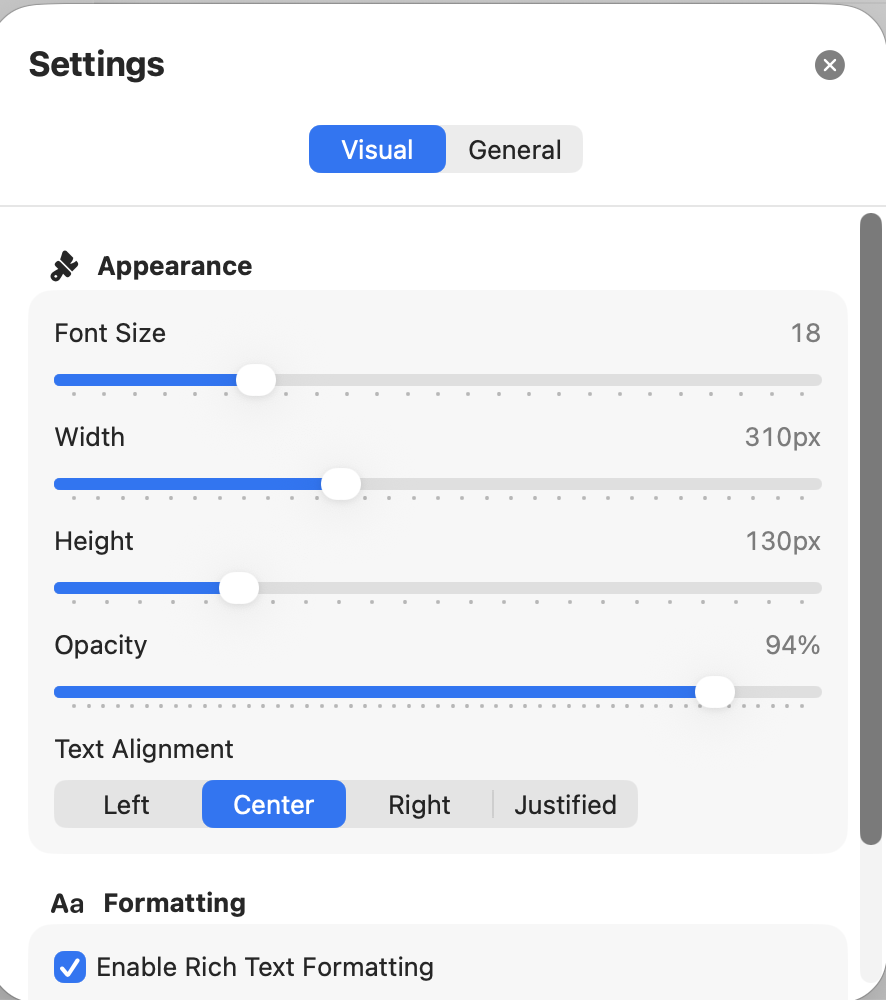
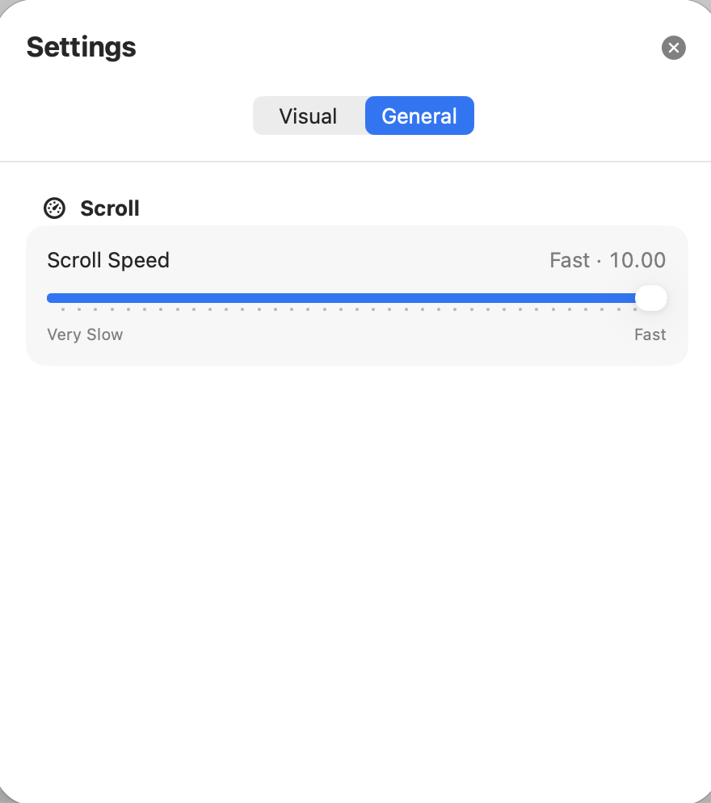

# OpenCue

A macOS teleprompter that hides in your MacBook notch — invisible to screen recordings.

I built this for myself. English isn't my first language, and I run a [YouTube channel](https://www.youtube.com/@michaelhimself-ai) where I record talking-head videos. I needed a teleprompter that:

- sits right above the camera so I look natural
- doesn't show up in recordings
- lets me control scroll speed and pause mid-recording

Nothing I found did all three, so I made OpenCue.

## How It Works

Write your script in the editor. Hit play. Your text scrolls in a floating panel aligned to the MacBook notch — right where the camera is. The panel uses `NSWindow.sharingType = .none`, so most screen recording and video call tools won't capture it.

**What you see on your screen (phone photo):**

<p align="center">
  
  
</p>

**What gets recorded:** the notch area is empty — the teleprompter is invisible.

> **Note:** Capture invisibility is best-effort. It works with QuickTime, Zoom, and most common tools, but test with your specific setup to be sure.

## Screenshots

| Editor | Visual Settings | Speed Control |
|--------|----------------|---------------|
|  |  |  |

## Features

- Teleprompter panel aligned to the MacBook notch
- Invisible to most screen recordings and video calls
- Adjustable scroll speed, font size, width, height, and opacity
- Hover to pause, move away to resume
- Keyboard shortcuts for play/pause, speed, and reset
- Organize scripts into folders and notes
- Native macOS app — no Electron, no web views

## Download

**[Download the latest DMG](https://github.com/Michaellzd/OpenCue/releases/latest/download/OpenCue.dmg)**

Or visit the [Releases page](https://github.com/Michaellzd/OpenCue/releases/latest).

> The app is not notarized yet. On first launch, right-click the app and select Open, or go to System Settings → Privacy & Security to allow it.

## Keyboard Shortcuts

| Shortcut | Action |
|----------|--------|
| `Cmd+Shift+P` | Play / Pause |


## Build From Source

Requires macOS 14+, a notch MacBook, and Xcode 15+.

```bash
./scripts/build-local-release.sh
```

To package a DMG:

```bash
./scripts/make-local-dmg.sh
```

See [RELEASING.md](./RELEASING.md) for the full release workflow.

## License

[MIT](./LICENSE)
